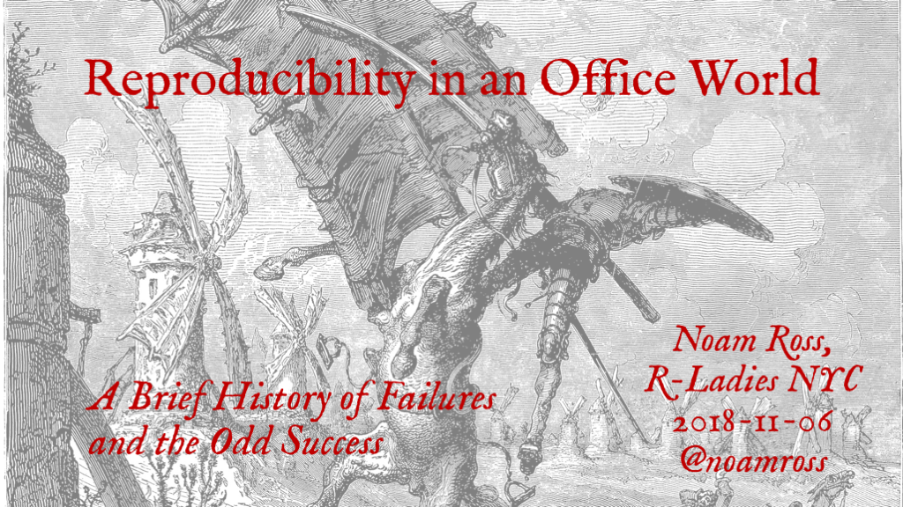

[](2018-11-06-rladies-office-talk.pdf)

[Slides](2018-11-06-rladies-office-talk.pdf) from a talk given at the [R-Ladies NYC](http://www.rladiesnyc.org/) meetup [on 2018-11-06](https://www.meetup.com/rladies-newyork/events/255925263/).  

(Lovely [Gustave Doré Engraving](https://commons.wikimedia.org/wiki/File:Adventure_with_the_Windmills.jpg) from "The Ingenious Hidalgo Don Quixote of La Mancha" - 1863.)

## Resources and references

-  R packages by [David Gohel](https://twitter.com/davidgohel):
[officer](https://davidgohel.github.io/officer/),
[rvg](https://github.com/davidgohel/rvg),
[flextable](https://davidgohel.github.io/flextable/),
[mschart](https://ardata-fr.github.io/mschart/),
[worded](https://github.com/davidgohel/worded) (in development as of 2018-11-06)
-  [ArchieML](http://archieml.org/), the New York Times' flexible markup for a Google Docs --> Structured Data workflow

## Some code snippets demo'd

### Reducing Round-trips: Making an editable Powerpoint Graphic from R with **rvg**

```r
library(officer)
library(rvg)
library(tidyverse)  # ggplot and pipes

# Make a plot
my_ggplot <-
  ggplot(mtcars, aes(mpg, wt)) +
  geom_point(col = "red", size = 4) +
  labs(x = "Fuel efficiency (mpg)", y = "Weight (tons)",
       title = "Seminal ggplot2 scatterplot example",
       subtitle = "A plot that is only useful for demonstration purposes",
       caption = "Brought to you by the letter 'g'")

# Take a look
my_ggplot

# Draw it using office vector graphics
read_pptx() %>%    # Start with a blank PPT when no arg is given
  add_slide(layout = "Title and Content", master = "Office Theme") %>%
  ph_with_text("Vector graphics, nice.", type = "title") %>%
  ph_with_vg(ggobj = my_ggplot) %>%
  print("my_slide.pptx")
```

### Shortening the journey: Post-processing a knitted word document

```r
library(officer)
library(magrittr)
library(rmarkdown)

# Create a new rmarkdown output format to use
doc_enhanced <- function(...) {
  # Start with an existing format, modify defaults and pass on other args
  out <- rmarkdown::word_document(reference_doc = "template.docx", ...)

  # Add function that will modify the output after the fact
  out$post_processor <- function(metadata, input_file, output_file, clean, verbose) {
    
    
    doc <- read_docx("template.docx") %>%  # Re-use the template
      body_add_docx(output_file) %>%       # Pour the output into it
      body_replace_img_at_bkm(             # Add annotations at bookmarks
        bookmark = "logo",
        value = external_img(src = "sidebar.png", width = 1.77, height = 6.031))
    print(doc, output_file)
    return(output_file)                   # Return the path of the modified file
  }
  return(out)
}

# Now use this format to render
rmarkdown::render("word_doc.Rmd", output_format = doc_enhanced())
```

